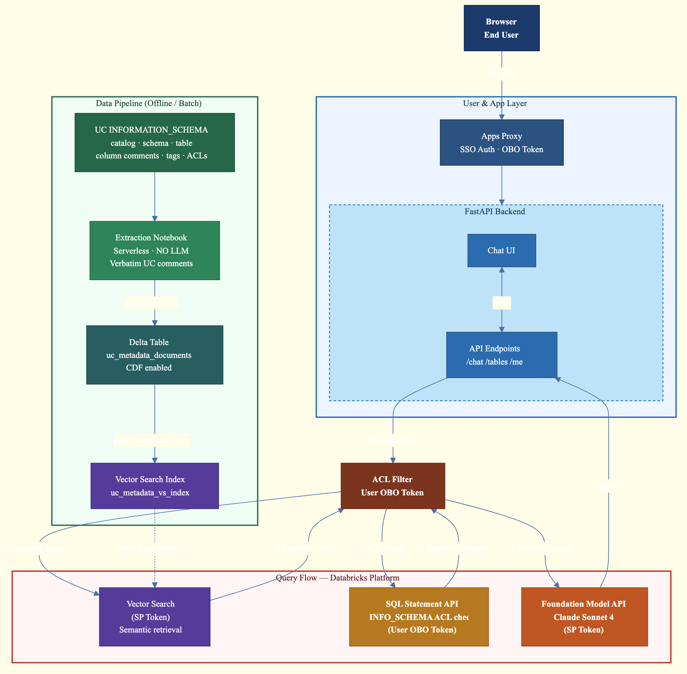

# UnityCatalogInsights

A Databricks App that lets users explore and understand their Unity Catalog metadata through natural language conversation. Ask questions like *"What tables contain customer credit information?"* or *"How can I join customer data with credit scores?"* and get grounded, context-aware answers with source references.

Descriptions are sourced directly from **user-authored UC comments** at the catalog, schema, table, and column levels — no LLM is used during indexing.



## Features

- **Natural Language Data Discovery** — Ask questions about your data catalog in plain English. The agent retrieves relevant table metadata via semantic search and generates detailed answers using an LLM.
- **User-Authored Descriptions** — Indexes existing comments from Unity Catalog at every level (catalog, schema, table, column) plus tags. No LLM-generated descriptions — what users documented is what gets indexed.
- **Per-Table ACL Enforcement** — Each table returned by Vector Search is checked via `SHOW GRANTS` to verify the logged-in user has access. Tables the user cannot see are filtered out before reaching the LLM. Fail-closed: if access can't be verified, the table is excluded.
- **Source Attribution** — Every answer includes source cards showing which tables were used, with relevance scores.
- **Sidebar Table Browser** — Browse all indexed tables in the sidebar and click to learn more about any table.

## Architecture

### Query Flow

```
User Question
    |
    v
[1] Vector Search (semantic retrieval — SP token)
    |
    v
[2] For each candidate table: SHOW GRANTS ON TABLE (SP token)
    → Check if user's email/ID appears in grants
    |
    v
[3] Filter to only tables the user has access to
    |
    v
[4] Foundation Model API / Claude Sonnet 4 (generate answer — SP token)
    |
    v
Answer + Sources → User
```

### Data Pipeline (Offline Indexing)

```
Unity Catalog INFORMATION_SCHEMA
    |
    +-- Catalog comments (DESCRIBE CATALOG)
    +-- Schema comments (information_schema.schemata)
    +-- Table comments (information_schema.tables)
    +-- Column comments (information_schema.columns)
    +-- Tags (table_tags, column_tags)
    +-- ACLs (table_privileges)
    |
    v
Extraction Notebook (serverless compute) — no LLM calls
    |
    v
Delta Table (uc_metadata_documents, Change Data Feed enabled)
    |
    v
Vector Search Index (Delta Sync, BGE-Large embeddings)
```

### How ACL Filtering Works

Vector Search indexes are static snapshots — they don't enforce per-user Unity Catalog permissions at query time. To prevent metadata leakage:

1. Vector Search returns candidate tables based on semantic similarity
2. For **each table**, the backend runs `SHOW GRANTS ON TABLE <table>` via the SQL Statement API
3. `SHOW GRANTS` returns all grants **including inherited grants** from catalog and schema levels
4. The backend checks if the logged-in user's **email** (from `x-forwarded-email`) or **user ID** (from `x-forwarded-user`) appears in the grantees, or if the table is accessible via `account users` / `users` groups
5. **Only accessible tables** are passed to the LLM for answer generation
6. **Fail-closed**: if a grant check fails for any reason, the table is excluded

### Authentication

| API Call | Token | Identity Check |
|----------|-------|---------------|
| Vector Search | SP token (PAT) | N/A — system-level query |
| `SHOW GRANTS ON TABLE` | SP token (PAT) | User's email/ID matched against grant results |
| Foundation Model API | SP token (PAT) | N/A — system-level query |
| User identity | N/A | Extracted from Databricks Apps proxy headers (`x-forwarded-email`, `x-forwarded-user`) |

## Project Structure

```
UnityCatalogInsights/
├── app.yaml                          # Databricks App configuration
├── requirements.txt                  # Python dependencies
├── backend/
│   ├── main.py                       # FastAPI backend (chat, search, ACL filtering)
│   └── requirements.txt              # Backend-specific dependencies
├── frontend/
│   ├── dist/
│   │   └── index.html                # Production frontend (self-contained, CDN-loaded)
│   └── static/
│       └── index.html                # Alternate static frontend
└── notebooks/
    └── 01_extract_and_index_uc_metadata.py   # Metadata extraction & VS indexing notebook
```

## Setup & Deployment

### Prerequisites

- A Databricks workspace with Unity Catalog enabled
- Tables with comments/descriptions you want to index
- A SQL Warehouse (for `SHOW GRANTS` ACL checks at runtime)
- Access to Foundation Model API endpoints (Claude Sonnet 4 for answers, BGE-Large for embeddings)
- An existing Vector Search endpoint in ONLINE state

### Step 1: Run the Metadata Extraction Notebook

1. Import `notebooks/01_extract_and_index_uc_metadata.py` into your workspace
2. Update the configuration variables at the top:
   ```python
   CATALOG = "your_catalog"
   SCHEMA = "your_schema"
   VS_ENDPOINT = "your-vs-endpoint"  # Must be an existing ONLINE endpoint
   ```
3. Attach to a cluster or run as a serverless job
4. Run All — the notebook will:
   - Extract comments at catalog, schema, table, and column levels from `INFORMATION_SCHEMA`
   - Collect tags and ACL/privilege information
   - Build searchable documents from existing UC metadata (no LLM calls)
   - Save to a Delta table with Change Data Feed enabled
   - Create or sync a Vector Search index with BGE-Large embeddings

### Step 2: Create and Deploy the App

```bash
# Create the app
databricks apps create unity-catalog-insights --profile=<your-profile>

# Sync source code to workspace
databricks sync . /Users/<you>/apps/unity-catalog-insights --profile=<your-profile> --full

# Deploy
databricks apps deploy unity-catalog-insights \
  --source-code-path /Workspace/Users/<you>/apps/unity-catalog-insights \
  --profile=<your-profile>
```

### Step 3: Configure Authentication

Update `app.yaml` with your environment:

```yaml
env:
  - name: DATABRICKS_HOST
    valueFrom: workspace-url
  - name: DATABRICKS_TOKEN
    value: "<your-pat-token>"        # PAT with access to VS, LLM, and SQL DW
  - name: VS_ENDPOINT
    value: "<your-vs-endpoint>"
  - name: VS_INDEX
    value: "<catalog.schema.index_name>"
  - name: LLM_ENDPOINT
    value: "databricks-claude-sonnet-4"
  - name: WAREHOUSE_ID
    value: "<your-warehouse-id>"     # SQL warehouse for SHOW GRANTS checks
```

### Step 4: Grant Permissions

The PAT owner (or service principal) needs:
- `USE_CATALOG` on the target catalog
- `USE_SCHEMA` and `SELECT` on the target schema
- Access to query the Vector Search endpoint
- Access to query the Foundation Model API serving endpoints
- Membership in the workspace `users` group (for Foundation Model API access)
- Permission to run `SHOW GRANTS` on tables in the catalog

## Tech Stack

| Component | Technology |
|-----------|-----------|
| Backend | FastAPI + Uvicorn |
| Frontend | Vanilla JS + React (CDN) + Marked.js |
| Search | Mosaic AI Vector Search (Delta Sync, BGE-Large embeddings) |
| LLM (answers only) | Foundation Model API (Claude Sonnet 4) |
| ACL Enforcement | `SHOW GRANTS ON TABLE` via SQL Statement API |
| Deployment | Databricks Apps |
| Data Storage | Delta Lake (with Change Data Feed) |
| Metadata Source | Unity Catalog comments (catalog, schema, table, column) + tags |

## API Endpoints

| Endpoint | Method | Description |
|----------|--------|-------------|
| `/api/health` | GET | Health check with config details |
| `/api/me` | GET | Current user identity (from proxy headers) |
| `/api/chat` | POST | Main chat — takes `{message, num_results}`, returns `{answer, sources}` |
| `/api/tables` | GET | List all indexed tables visible to current user |
| `/api/table/{name}` | GET | Get detailed metadata for a specific table |

## License

This project is licensed under the [Databricks License](LICENSE). See the LICENSE file for details.
